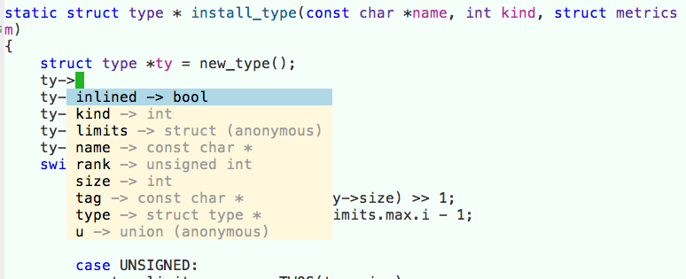

# configs

misc configuration

# Emacs auto-complete solution

yasnippet + libclang + irony-mode + company-irony

前提：

- Emacs >= 24.4
- CMake >= 2.8.3
- 安装有 Homebrew

#### 截图



#### Step 0: 添加源

.emacs 加入配置：

``` 
(when (>= emacs-major-version 24)
  (require 'package)
  (add-to-list
   'package-archives
   '("melpa" . "http://melpa.org/packages/")
   t)
  (package-initialize))
```

#### Step 1: 安装 libclang

``` shell
brew install llvm —with-clang
```

#### Step 2: 安装 yasnippet

``` lisp
M-x package-install RET yasnippet RET
```

配置 yasnippet

``` lisp
(add-to-list 'load-path
              "~/.emacs.d/plugins/yasnippet")
(require 'yasnippet)
(yas-global-mode 1)
```

#### Step 3: 安装 irony-mode

``` lisp
M-x package-install RET irony RET
```

配置 irony

``` lisp
(add-hook 'c++-mode-hook 'irony-mode)
(add-hook 'c-mode-hook 'irony-mode)
(add-hook 'objc-mode-hook 'irony-mode)

;; replace the `completion-at-point' and `complete-symbol' bindings in
;; irony-mode's buffers by irony-mode's function
(defun my-irony-mode-hook ()
  (define-key irony-mode-map [remap completion-at-point]
    'irony-completion-at-point-async)
  (define-key irony-mode-map [remap complete-symbol]
    'irony-completion-at-point-async))
(add-hook 'irony-mode-hook 'my-irony-mode-hook)
(add-hook 'irony-mode-hook 'irony-cdb-autosetup-compile-options)
```

**安装 irony server**

``` lisp
M-x irony-install-server RET
```

**可选步骤（如果上面make失败）**

Emacs echo buffer 会弹出 CMake 命令，添加参数：

``` 
-DLIBCLANG_LIBRARY=/usr/local/Cellar/llvm/<version>/lib 
-DLIBCLANG_INCLUDE_DIR=/usr/local/Cellar/llvm/<version>/include
```

其中，version 替换为第一步安装的 llvm 版本号。详见：

``` 
ls -l /usr/local/Cellar/llvm
```

#### Step 4: 安装 company-irony

``` lisp
M-x package-install RET company-irony RET
```

配置 company-irony:

``` lisp
(eval-after-load 'company
  '(add-to-list 'company-backends 'company-irony))
(add-hook 'c-mode-hook 'company-mode)
(add-hook 'c++-mode-hook 'company-mode)
(add-hook 'objc-mode-hook 'company-mode)
```

#### Step 5: 安装 company-irony-c-headers

``` lisp
M-x package-install RET company-irony-c-headers
```

修改配置：

``` 
(require 'company-irony-c-headers)

(eval-after-load 'company
  '(add-to-list 'company-backends '(company-irony-c-headers company-irony)))
```

#### Step 6: 添加 .clang_complete

在项目的根目录下创建文件 .clang_complete，里面填写编译选项，每个选项占一行。例如，对C程序而言：

``` 
-I/Applications/Xcode.app/Contents/Developer/Platforms/MacOSX.platform/Developer/SDKs/MacOSX.sdk/usr/include
```

Enjoy !
